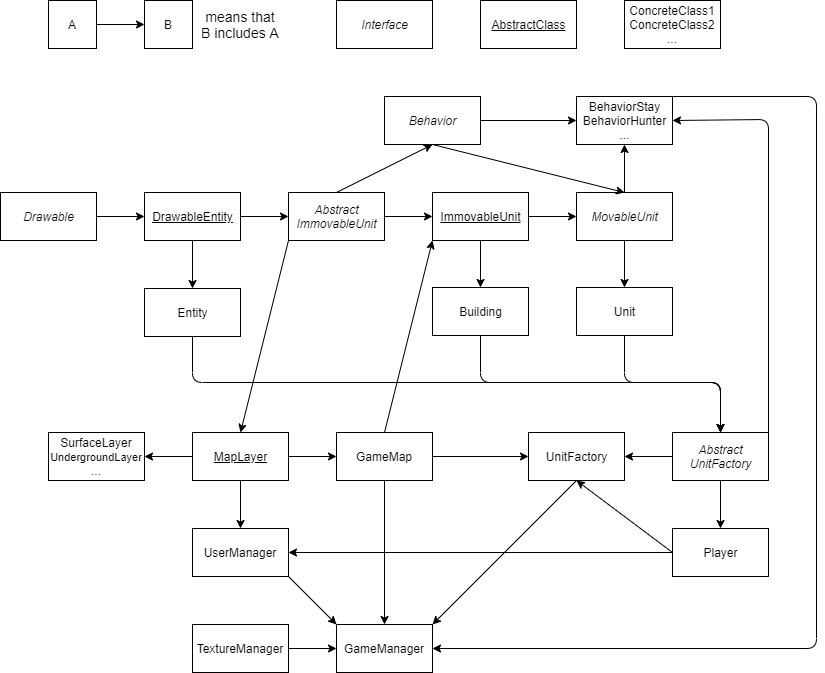

# RTS-game
Guides:
* [Game objects](https://github.com/zakoden/RTS-game/blob/master/game_objects.md)

What can one do with the current version:

* Move camera by arrow keys or by scroll edge
* Scroll camera by mousewheel

* Control movement of a unit by clicking on him
* Enable fullscreen by pressing F11
* Toggle fog of war mode by pressing F10
* Change player's screen by pressing tab (currently only changes fog of war)
* Change map layer (surface/underground) by pressing u

